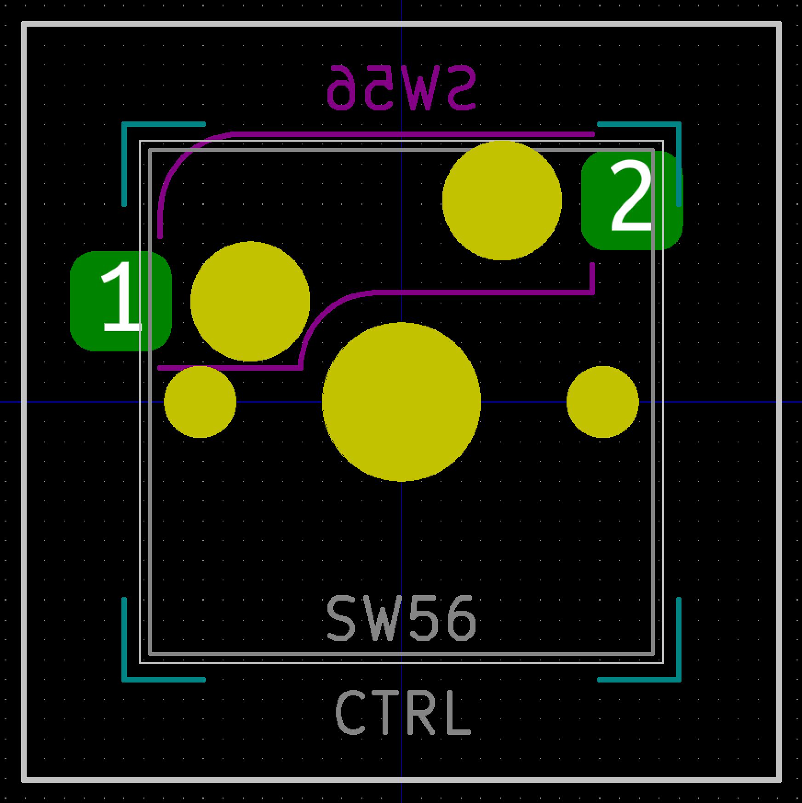
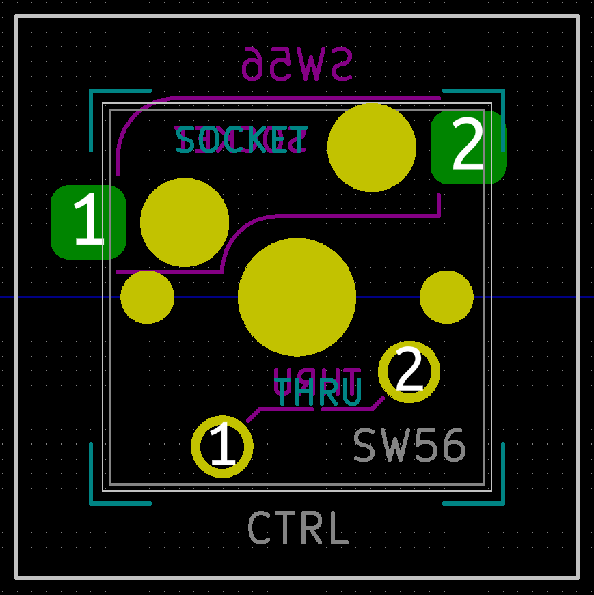

# Switch cherry MX Kailh Socket

### `Switch_Cherry_MX_1.00u_Kailh`

### `Switch_Cherry_MX_1.00u_Kailh_solder_hybrid`

Switch can be mounted in reverse direction with soldering. Useful when placing a TRRS jack between switches.

