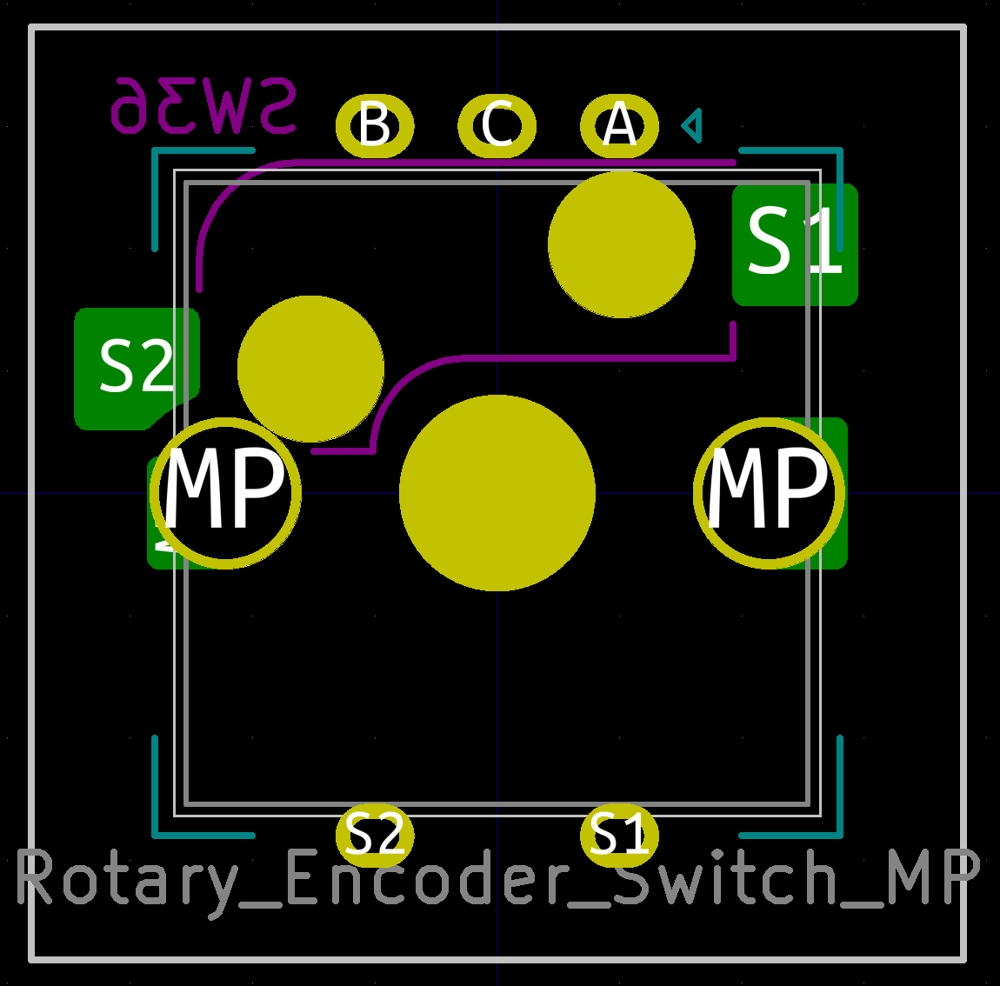

# Switch cherry MX Kailh Socket

## Common footprints

## Non-common footprints

Includes experimental footprints. Use with caution.

### Reversible

### With ALPS EC12 Rotary Encoder (Experimental)

### 1.00u + 1.25u XOR 2.25u (Experimental)

